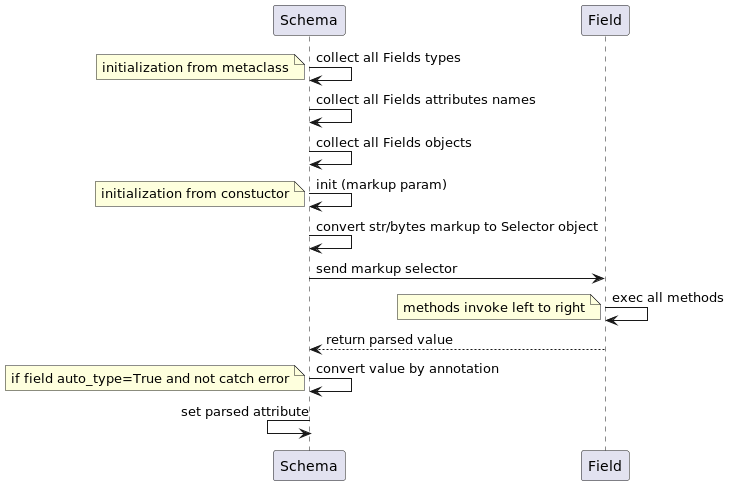

# How to, FAQ

## What you need to know to use this library
- You know how to use [scrapy/parsel](https://parsel.readthedocs.io/en/latest/) library
- You know [css selectors](https://en.wikipedia.org/wiki/CSS)
- You know [xpath selectors](https://en.wikipedia.org/wiki/XPath)
- **Optional** You know [regex](https://docs.python.org/3.11/howto/regex.html#regex-howto)

## How this library works?
At a high level performs the following steps:

### Prepare class steps

1. collect all types for Fields objects
2. collect all attributes names for Fields objects
3. collect all Fields objects

### parse steps

1. accept markup argument, convert to `parsel.Selector` object if markup is _str_ or _bytes_
2. passes the markup to the `Field object`
3. all methods are executed from **left to right**
4. If there are no errors and **auto_type** is enabled, it converts the received value based on the annotation


Sequence diagram

## bs4 allowed?
Yes you can! **But you will lose all the features and profits of this library!**

Also, you will complicate your code and debugging if you don't use fields objects.

```python
# Note: bs4 is not recommended: you will lose performance and core library functions!
from typing import Any

from bs4 import BeautifulSoup
from scrape_schema import BaseSchema, sc_param


class Schema(BaseSchema):
    def __init__(self, markup: Any):
        super().__init__(markup)
        self.soup = BeautifulSoup(markup, "lxml")

    @sc_param
    def h1(self):
        return self.soup.find("h1").text

    @sc_param
    def urls(self):
        return [li.find("a").get("href") for li in self.soup.find_all("li")]

    # I'm too lazy to write more :D


if __name__ == '__main__':
    text = """
            <html>
                <body>
                    <h1>Hello, Parsel!</h1>
                    <ul>
                        <li><a href="http://example.com">Link 1</a></li>
                        <li><a href="http://scrapy.org">Link 2</a></li>
                    </ul>
                    <script type="application/json">{"a": ["b", "c"]}</script>
                </body>
            </html>"""
    print(Schema(text).dict())
    # {'h1': 'Hello, Parsel!', 'urls': ['http://example.com', 'http://scrapy.org']}
```
