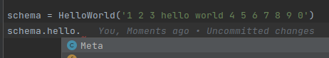
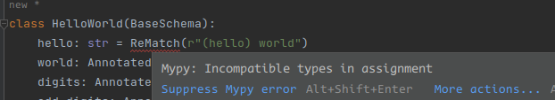

**Documentation for version 0.0.10**

# Scrape-schema

This library is designed to write structured, readable, 
reusable parsers for various text data (like html, stdout or any text) and 
inspired by data class architecture

# Motivation
Simplifying parsers support, (mostly html, stdout output, unstructured text and unofficial APIs), 
where it is difficult to use or the complete absence of the **REST API**.

Also structuring, data serialization and use as an intermediate layer 
for third-party serialization libraries: json, dataclasses, attrs, pydantic, etc

# Install
zero dependencies (re, nested)
```shell
pip install scrape-schema
```
add bs4 fields
```shell
pip install scrape-schema[bs4]
```

add selectolax fields
```shell
pip install scrape-schema[selectolax]
```
add all fields
```shell
pip install scrape-schema[all]
```
____
# Project structure
```
scrape_schema
├── base.py  # base schema, base fields classes 
├── exceptions.py  # custom exception classes
├── callbacks
│    ├── slax.py # selectolax build-in common callbacks, crop_rules
│    └── soup.py # bs4 build-in common callbacks, crop_rules
├── factory
│    └── __init__.py # TODO build-in common factory callbacks
└── fields
     ├── nested.py  # Nested fields
     ├── regex.py  # re backend fields
     ├── slax.py  # selectolax (Modest) backend fields
     └── soup.py  # bs4 backend fields
```

# Fields
## How it works
1. extract string from text
2. if it's not founded or empty - set `default` value
3. if it's iterable (not str) - call `filter_`, for first filter values
4. applies a callback function on a value. If value is iterable, applies for every element
5. if a `factory` function is passed - applies this for value, ignore auto type-cast and return a factored value
6. if factory is None - try to apply auto type-cast

Arguments eval steps:

1. parse value
2. if value None - return default
3. filter_ (if list/iterable)
4. eval callback elements
5. typing or factory

## About typing.Annotated 

This project usage [Annotated](https://docs.python.org/3/library/typing.html#typing.Annotated)
[(PEP 593)](https://peps.python.org/pep-0593/) typehint for annotation fields in runtime
and make the static type checker happy 😀 and didn't need write a mypy plugin 🤯.

if you have python <3.9 - install `typing_extension`
```python
from typing_extensions import Annotated
```



**No annotation** - IDE marks attribute as "ReMatch" object (it's wrong)
____



Without **Annotated** type - static type checker marks as error
____


With **Annotated** - correct type, mypy OK
____

## About any parsers library
This library is not designed to work with structured formats like:

* cfg
* yaml
* toml
* json
* msgpack
* any structures

Use third-party libraries designed for these structures!
