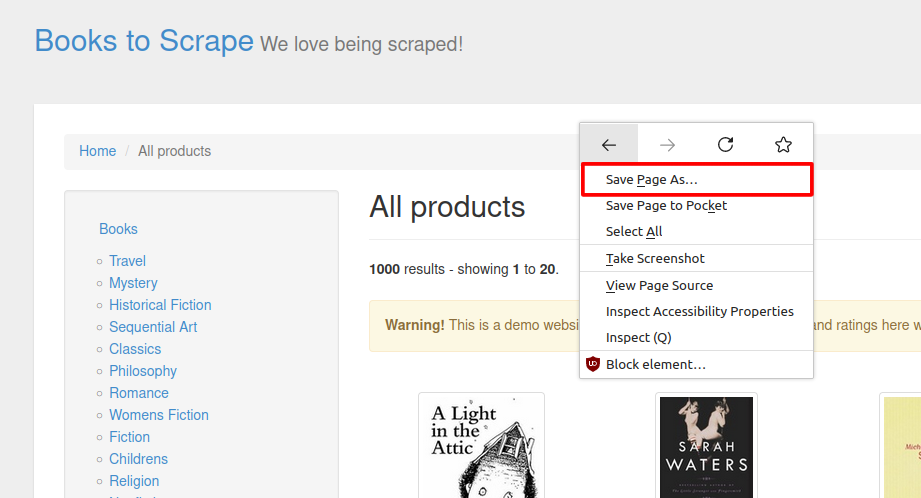
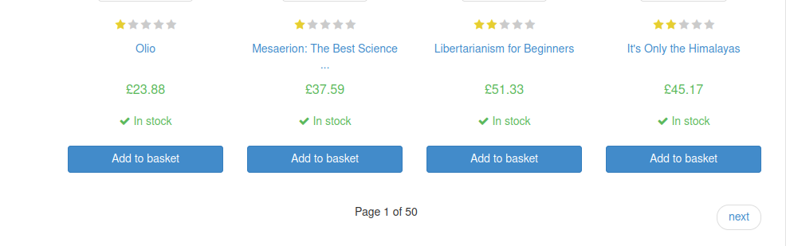
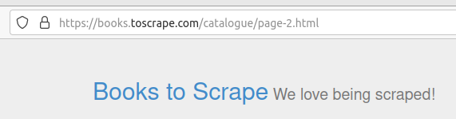
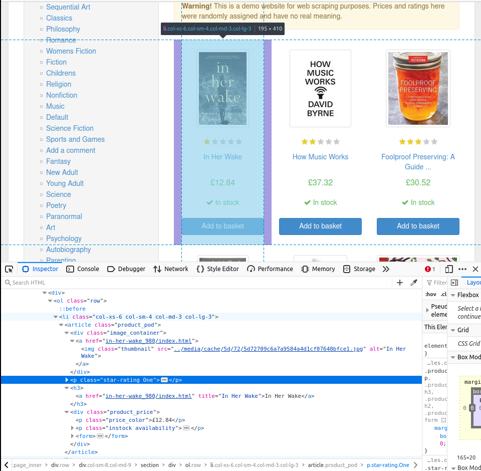
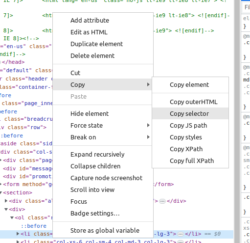
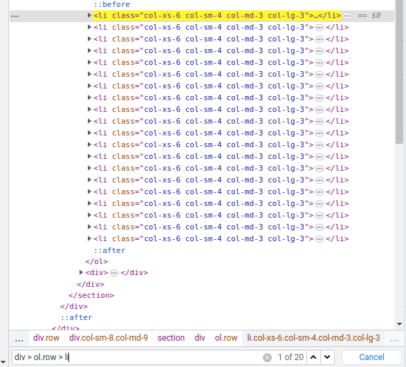

# Web scraper tutorial
>>> Note: in this tutorial there will be no theory of writing css, xpath selectors and usage parsers library 
> It assumes that you know how to write them.
> 
> [css selectors MDN](https://developer.mozilla.org/en-US/docs/Learn/CSS/Building_blocks/Selectors)
>
> [xpath cheat sheet](https://devhints.io/xpath)
>
> [parsel documentation](https://parsel.readthedocs.io/en/latest/)
> 
> [selectolax documentation](https://selectolax.readthedocs.io/en/latest/index.html)
> 
> [bs4 documentation](https://www.crummy.com/software/BeautifulSoup/bs4/doc/)


# Parsers library choice

At the time of writing the tutorial, fields with support `bs4`, `selectolax`, `parsel` libraries.
Which one to choose or use depends on your circumstances and preferences, or you can use them
**all together at once** 🤪

```python
from parsel import Selector
from bs4 import BeautifulSoup
from selectolax.parser import HTMLParser

from scrape_schema import BaseSchema, BaseSchemaConfig, ScField
from scrape_schema.fields.regex import ReMatch
from scrape_schema.fields.soup import SoupFind, SoupSelect
from scrape_schema.fields.parsel import ParselSelect, ParselXPath
from scrape_schema.fields.slax import SlaxSelect


class MixSchema(BaseSchema):
    class Config(BaseSchemaConfig):
        parsers_config = {
            BeautifulSoup: {"features": "lxml"},  # add fields.soup support
            Selector: {},  # add fields.parsel support
            HTMLParser: {}  # add fields.slax (selectolax) support
        }
    title_re: ScField[str, ReMatch(r"<title>(.*?)</title>")]
    
    title_soup_find: ScField[str, SoupFind("<title>")]
    title_soup_select: ScField[str, SoupSelect("title")]
    
    title_parsel_select: ScField[str, ParselSelect("title")]
    title_parsel_xpath: ScField[str, ParselXPath("//title")]
    
    title_slax: ScField[str, SlaxSelect("title")]

print(MixSchema("<title>OMG!!! PARSERS LIBS COLLAB</title>"))
# MixSchema(
# title_re:str='OMG!!! PARSERS LIBS COLLAB', 
# title_soup_find:str='OMG!!! PARSERS LIBS COLLAB', 
# title_soup_select:str='OMG!!! PARSERS LIBS COLLAB', 
# title_parsel_select:str='OMG!!! PARSERS LIBS COLLAB', 
# title_parsel_xpath:str='OMG!!! PARSERS LIBS COLLAB', 
# title_slax:str='OMG!!! PARSERS LIBS COLLAB')
```

This tutorial will write implementations of parsers for all types of fields (except regex)

>>> Lifehack: when you write a parser for a real project, download the html page as a file and experiment on it:
> You can do this through a request with saving it to a file or 
> in the browser on the page, right-click and select "Save As..."

Recipe 1:
```python
import requests
response = requests.get("https://books.toscrape.com/index.html")
with open("page.html", "w") as f:
    f.write(response.text)
```

Recipe 2:


# logging feature
The logger is enabled at the `DEBUG` level by default for quick error detection reasons

for decrease logs messages or disable this - get logger by `scrape_schema` name:
```python
import logging

logger = logging.getLogger("scrape_schema")
logger.setLevel(logging.INFO)
```

## Example

An error in the `p` attribute was made intentionally to demonstrate the information content of the logs.
The `p` attribute returned `None`, but expected - `scrape me!`

```python
from bs4 import BeautifulSoup
from scrape_schema.fields.soup import SoupFind
from scrape_schema import BaseSchema, ScField, BaseSchemaConfig

class Schema(BaseSchema):
    class Config(BaseSchemaConfig):
        parsers_config = {BeautifulSoup: {"features": "lxml"}}
    title: ScField[str, SoupFind("<title>")]
    p: ScField[str, SoupFind("<pa>")]

print(Schema("<title>title</title>\n<p>scrape me!</p>"))
# ...
# 2023-05-02 17:22:47,672 [INFO] Schema.p[<class 'bs4.BeautifulSoup'>]: Field attrs: factory=None, callback=<function get_text.<locals>.wrapper at 0x7fc18c0ef7f0>, filter_=None, default=None
# 2023-05-02 17:22:47,672 [DEBUG] Schema.p: value not found, set default `None` value
# 2023-05-02 17:22:47,672 [DEBUG] Schema.p := callback(None)
# 2023-05-02 17:22:47,672 [INFO] `SoupFind` Cast type start. `value=None`, type_annotation=<class 'str'>, `origin=None`, `args=()`
# 2023-05-02 17:22:47,672 [INFO] Schema.p = `None` Done
# 2023-05-02 17:22:47,672 [DEBUG] `Schema.p[SoupFind] = None`
# 2023-05-02 17:22:47,672 [DEBUG] Schema done! Fields fails: 0
```

Now, we see next log message:
```
2023-05-02 17:22:47,672 [DEBUG] Schema.p: value not found, set default `None` value
```
Go to `p` attribute in `Schema` and fix it!

```python
from bs4 import BeautifulSoup
from scrape_schema.fields.soup import SoupFind
from scrape_schema import BaseSchema, ScField, BaseSchemaConfig


class Schema(BaseSchema):
    class Config(BaseSchemaConfig):
        parsers_config = {BeautifulSoup: {"features": "lxml"}}
    title: ScField[str, SoupFind("<title>")]
    p: ScField[str, SoupFind("<p>")]  # fix

print(Schema("<title>title</title>\n<p>scrape me!</p>"))
# ...
# 2023-05-05 02:45:49,361 [INFO] Schema.p[<class 'bs4.BeautifulSoup'>]: Field attrs: factory=None, callback=<function get_text.<locals>.wrapper at 0x7fd710461510>, filter_=None, default=None
# 2023-05-05 02:45:49,361 [DEBUG] Schema.p := <p>scrape me!</p> raw value(s)
# 2023-05-05 02:45:49,361 [DEBUG] Schema.p := callback(<p>scrape me!</p>)
# 2023-05-05 02:45:49,361 [INFO] `SoupFind` Cast type start. `value=scrape me!`, type_annotation=<class 'str'>, `origin=None`, `args=()`
# 2023-05-05 02:45:49,361 [DEBUG] Cast `SoupFind` := `<class 'str'>(scrape me!)`
# 2023-05-05 02:45:49,361 [INFO] Schema.p = `scrape me!` Done
# 2023-05-05 02:45:49,361 [DEBUG] `Schema.p[SoupFind] = scrape me!`
# 2023-05-05 02:45:49,361 [DEBUG] Schema done! Fields fails: 0
```

# tasks steps
1. send HTTP GET request to `https://books.toscrape.com/index.html`. You can use any HTTP library or send `curl` request
and get stdout response from terminal 🤯 (The following examples use `requests`). 
2. get response text
3. parse values
4. serialise or save
5. go to next page
6. repeat 1-5 steps

# start write parser
For demonstration, we will write on soup, slax, parsel modules
## inspect page



this shop in catalogue have 1000 books and 50 pages



and have `https://books.toscrape.com/catalogue/page-{}.html` pagination format

```python
from typing import Generator
import requests  # you can usage any http library
from time import sleep


def request_pagination(start: int =1, end: int = 50) -> Generator[str, None, None]:
    """requests pagination generator"""
    for page in range(start, end + 1):
        yield requests.get(f"https://books.toscrape.com/catalogue/page-{page}.html").text
        sleep(0.3)         
```

### page inspection
Inspect page to find and extract the required information. In this example, we want to receive information about books


Copy selector



We can get selector like this:

`#default > div > div > div > div > section > div:nth-child(2) > ol > li:nth-child(1)`

Simplify selector: `div > ol.row > li`



Now from this selector we write paths to elements with the necessary information

### Book
Book extract by selectors steps:

* url - page `div.image_container > a`
* image book image `div.image_container > a > img`
* name - book name `h3 > a` in **title** attribute
* rating - book rating `p.star-rating`. Rating contains in second class attribute - need write logic for extract this
* price - book price `div.product_price > p.price_color`
* available - in stock? `div.product_price > p.instock.availability > i` 

# write parser

## NestedList
The `Nested` and `NestedList` fields allow for the nested extraction of data by defining a sub-schema. 
These fields can be used when the target data contains substructures that can be parsed as separate schemas, 
and then combined with the parent schema.

To prevent duplicate selector `div > ol.row > li` use `NestedList` and cut elements by selector

### Example

```python
from scrape_schema.callbacks.soup import crop_by_selector_all

HTML = """
<div class="a">
<p>spam</p>
</div>

<div class="a">
<p>egg</p>
</div>
"""
print(crop_by_selector_all('div.a', features="lxml")(HTML))
# ['<div class="a">\n<p>spam</p>\n</div>', <div class="a">\n<p>egg</p>\n</div>]
```

## bs4
```python
from typing import Generator
from time import sleep
import pprint

import requests
from bs4 import BeautifulSoup

from scrape_schema import BaseSchema, ScField, BaseSchemaConfig

from scrape_schema.fields.soup import SoupSelect
from scrape_schema.fields.nested import NestedList

from scrape_schema.callbacks.soup import get_attr, get_text, crop_by_selector_all


def request_pagination(start: int =1, end: int = 50) -> Generator[str, None, None]:
    """requests pagination generator"""
    for page in range(start, end + 1):
        yield requests.get(f"https://books.toscrape.com/catalogue/page-{page}.html").text
        sleep(0.3)         

        
class MainSchema(BaseSchema):
    class Config(BaseSchemaConfig):
        # base schema configuration might be reused
        parsers_config = {BeautifulSoup: {"features": "lxml"}}


class Book(MainSchema):
    url: ScField[str, SoupSelect("div.image_container > a", 
                                 callback=get_attr("href"))]
    image: ScField[str, SoupSelect("div.image_container > a > img", 
                                   callback=get_attr("src"))]
    rating: ScField[str, SoupSelect('p.star-rating',
                                    callback=lambda tag: tag.get("class")[-1])]
    name: ScField[str, SoupSelect("h3 > a", callback=get_attr("title"))]
    price: ScField[str, SoupSelect("div.product_price > p.price_color")]
    available: ScField[str, SoupSelect("div.product_price > p.instock.availability")]


class CataloguePage(MainSchema):
    books: ScField[
        list[Book],
        NestedList(Book,
                   crop_rule=crop_by_selector_all("section > div > ol.row > li",
                                                  features="lxml"))]


for resp in request_pagination():
    pprint.pprint(CataloguePage(resp).dict(), compact=True)
    break
# {'books': [{'available': '\n\n    \n        In stock\n    \n',
#             'image': '../media/cache/2c/da/2cdad67c44b002e7ead0cc35693c0e8b.jpg',
#             'name': 'A Light in the Attic',
#             'price': '£51.77',
#             'rating': 'Three',
#             'url': 'a-light-in-the-attic_1000/index.html'},
#            {'available': '\n\n    \n        In stock\n    \n',
#             'image': '../media/cache/26/0c/260c6ae16bce31c8f8c95daddd9f4a1c.jpg',
#             'name': 'Tipping the Velvet',
#             'price': '£53.74',
#             'rating': 'One',
#             'url': 'tipping-the-velvet_999/index.html'},
```
next, need enchant values:

* available - strip newline (`\n`) symbols
* image - enchant path to full url
* price - enchant to float value
* rating - enchant to integer value
* url - enchant path to full url

## About HooksStorage
HookStorage is a singleton class, has the following syntax for global binding of callback functions

Has the following syntax:
```
hooks = HooksStorage()

@hooks.on_<action>("<SchemaName>.<attribute_1>",
                    "<SchemaName>.<attribute_2>",
                    ...
                    "<SchemaName>.<attribute_n>")
def something_action(value):
    ...
```

### Example: 
```python
from scrape_schema import ScField, BaseSchema
from scrape_schema.hooks import HooksStorage
from scrape_schema.fields.regex import ReMatch

hooks = HooksStorage()

@hooks.on_callback("Schema.word")
def _upper(val: str) -> str:
    return val.upper()

class Schema(BaseSchema):
    word: ScField[str, ReMatch(r"([a-z]+)")]


class Schema2(BaseSchema):
    word: ScField[str, ReMatch(r"([a-z]+)", callback=lambda s: s.upper())]
    
    
class Schema3(BaseSchema):
    word: ScField[str, ReMatch(r"([a-z]+)", callback=_upper)]
    


sc_1 = Schema("dolor")
sc_2 = Schema2("dolor")
sc_3 = Schema3("dolor")
assert sc_1.dict() == sc_2.dict()
assert sc_2.dict() == sc_3.dict()
assert sc_1.dict() == sc_3.dict()
print(sc_1, sc_2, sc_3, sep="\n")
# Schema(word:str='DOLOR')
# Schema2(word:str='DOLOR')
# Schema3(word:str='DOLOR')
```

Schema, Schema2, Schema3 have the same value conversion logic!

## add enchant values

```python
from typing import Generator, Optional
from time import sleep
import pprint

import bs4
import requests
from bs4 import BeautifulSoup

from scrape_schema.hooks import HooksStorage
from scrape_schema import BaseSchema, ScField, BaseSchemaConfig
from scrape_schema.fields.soup import SoupSelect
from scrape_schema.fields.nested import NestedList
from scrape_schema.callbacks.soup import crop_by_selector_all, get_attr, get_text

hooks = HooksStorage()


def request_pagination(start: int =1, end: int = 50) -> Generator[str, None, None]:
    """requests pagination generator"""
    for page in range(start, end + 1):
        yield requests.get(f"https://books.toscrape.com/catalogue/page-{page}.html").text
        sleep(0.3)         

        
class MainSchema(BaseSchema):
    class Config(BaseSchemaConfig):
        parsers_config = {BeautifulSoup: {"features": "lxml"}}
        
        
@hooks.on_callback("Book.image")
def _concat_image(tag: bs4.Tag) -> str:
    # remove `..` symbols and concat url
    return "https://books.toscrape.com" + tag.get("src")[2:]


@hooks.on_callback("Book.rating")
def _rating_callback(tag: bs4.Tag) -> Optional[int]:
    # create dict table for convert string to integer
    ratings = {
        "One": 1,
        "Two": 2,
        "Three": 3,
        "Four": 4,
        "Five": 5
    }
    rating_key = tag.get("class")[-1]
    return ratings.get(rating_key)


@hooks.on_callback("Book.price")
def _price_callback(tag: bs4.Tag) -> str:
    # remove 2 chars and return string digit value 
    # (it's automatically converted to float) 
    return tag.get_text()[2:]


@hooks.on_callback("Book.url")
def _url_concat(tag: bs4.Tag) -> str:
    return f"https://books.toscrape.com/catalogue/{tag.get('href')}"


class BookInfo(MainSchema):
    ...


class Book(MainSchema):
    url: ScField[str, SoupSelect("div.image_container > a")]
    image: ScField[str, SoupSelect("div.image_container > a > img")]
    rating: ScField[int, SoupSelect('p.star-rating')]
    name: ScField[str, SoupSelect("h3 > a", callback=get_attr("title"))]
    price: ScField[float, SoupSelect("div.product_price > p.price_color")]
    available: ScField[str, SoupSelect("div.product_price > p.instock.availability",
                                       callback=get_text(strip=True))]
    
    @property
    def about(self):
        # you can go to book url page and collect extra information,
        # you can follow the link and parse more information like this construction, 
        # this tutorial will not implement
        response = requests.get(self.url).text
        return BookInfo(response)

    
class CataloguePage(MainSchema):
    books: ScField[list[Book],
                   NestedList(Book,
                              crop_rule=crop_by_selector_all(
                                  "section > div > ol.row > li",
                              features="lxml"))]


for resp in request_pagination():
    pprint.pprint(CataloguePage(resp).dict(), compact=True)
    sleep(1)
# {'books': [{'available': 'In stock',
#             'image': 'https://books.toscrape.com/media/cache/2c/da/2cdad67c44b002e7ead0cc35693c0e8b.jpg',
#             'name': 'A Light in the Attic',
#             'price': 51.77,
#             'rating': 3,
#             'url': 'https://books.toscrape.com/catalogue/a-light-in-the-attic_1000/index.html'},
#            {'available': 'In stock',
#             'image': 'https://books.toscrape.com/media/cache/26/0c/260c6ae16bce31c8f8c95daddd9f4a1c.jpg',
#             'name': 'Tipping the Velvet',
#             'price': 53.74,
#             'rating': 1,
#             'url': 'https://books.toscrape.com/catalogue/tipping-the-velvet_999/index.html'},
# ...
```

# Alternative realisations

## selectolax
```python
from typing import Generator, Optional, List
from time import sleep
import pprint

import requests
from selectolax.parser import HTMLParser, Node

from scrape_schema.hooks import HooksStorage
from scrape_schema import BaseSchema, ScField, BaseSchemaConfig
from scrape_schema.fields.slax import SlaxSelect
from scrape_schema.fields.nested import NestedList
from scrape_schema.callbacks.slax import crop_by_slax_all, get_attr, get_text

hooks = HooksStorage()


def request_pagination(start: int = 1, end: int = 50) -> Generator[str, None, None]:
    """requests pagination generator"""
    for page in range(start, end + 1):
        yield requests.get(f"https://books.toscrape.com/catalogue/page-{page}.html").text
        sleep(0.3)


class MainSchema(BaseSchema):
    class Config(BaseSchemaConfig):
        parsers_config = {HTMLParser: {}}


@hooks.on_callback("Book.image")
def _concat_image(node: Node) -> str:
    # remove `..` symbols and concat url
    return "https://books.toscrape.com" + node.attrs.get("src")[2:]


@hooks.on_callback("Book.rating")
def _rating_callback(node: Node) -> Optional[int]:
    # create dict table for convert string to integer
    ratings = {
        "One": 1,
        "Two": 2,
        "Three": 3,
        "Four": 4,
        "Five": 5
    }
    rating_key = node.attrs.get("class").split()[-1]
    return ratings.get(rating_key)


@hooks.on_callback("Book.price")
def _price_callback(node: Node) -> str:
    # remove 2 chars and return string digit value
    # (it's automatically converted to float)
    return node.text(deep=False)[2:]


@hooks.on_callback("Book.url")
def _url_concat(node: Node) -> str:
    return f"https://books.toscrape.com/catalogue/{node.attrs.get('href')}"


class BookInfo(MainSchema):
    ...


class Book(MainSchema):
    url: ScField[str, SlaxSelect("div.image_container > a")]
    image: ScField[str, SlaxSelect("div.image_container > a > img")]
    rating: ScField[int, SlaxSelect('p.star-rating')]
    name: ScField[str, SlaxSelect("h3 > a", callback=get_attr("title"))]
    price: ScField[float, SlaxSelect("div.product_price > p.price_color")]
    available: ScField[str, SlaxSelect("div.product_price > p.instock.availability",
                                       callback=get_text(strip=True))]

    @property
    def about(self):
        # you can go to book url page and collect extra information,
        # you can follow the link and parse more information like this construction,
        # this tutorial will not implement
        response = requests.get(self.url).text
        return BookInfo(response)


class CataloguePage(MainSchema):
    books: ScField[List[Book],
                   NestedList(Book,
                              crop_rule=crop_by_slax_all(
                                  "section > div > ol.row > li",
                                  ))]


for resp in request_pagination():
    pprint.pprint(CataloguePage(resp).dict(), compact=True)
    sleep(1)
# {'books': [{'available': 'In stock',
#             'image': 'https://books.toscrape.com/media/cache/2c/da/2cdad67c44b002e7ead0cc35693c0e8b.jpg',
#             'name': 'A Light in the Attic',
#             'price': 51.77,
#             'rating': 3,
#             'url': 'https://books.toscrape.com/catalogue/a-light-in-the-attic_1000/index.html'},
#            {'available': 'In stock',
#             'image': 'https://books.toscrape.com/media/cache/26/0c/260c6ae16bce31c8f8c95daddd9f4a1c.jpg',
#             'name': 'Tipping the Velvet',
#             'price': 53.74,
#             'rating': 1,
#             'url': 'https://books.toscrape.com/catalogue/tipping-the-velvet_999/index.html'},
# ...
```

## parsel

### css
```python
from typing import Generator, Optional, List
from time import sleep
import pprint

import requests
from parsel import Selector

from scrape_schema.hooks import HooksStorage
from scrape_schema import BaseSchema, ScField, BaseSchemaConfig
from scrape_schema.fields.parsel import ParselSelect
from scrape_schema.fields.nested import NestedList
from scrape_schema.callbacks.parsel import crop_by_selector_all, get_attr, get_text

hooks = HooksStorage()


def request_pagination(start: int = 1, end: int = 50) -> Generator[str, None, None]:
    """requests pagination generator"""
    for page in range(start, end + 1):
        yield requests.get(f"https://books.toscrape.com/catalogue/page-{page}.html").text
        sleep(0.3)


class MainSchema(BaseSchema):
    class Config(BaseSchemaConfig):
        parsers_config = {Selector: {}}


@hooks.on_callback("Book.image")
def _concat_image(sel: Selector) -> str:
    # remove `..` symbols and concat url
    return "https://books.toscrape.com" + sel.attrib.get("src")[2:]


@hooks.on_callback("Book.rating")
def _rating_callback(sel: Selector) -> Optional[int]:
    # create dict table for convert string to integer
    ratings = {
        "One": 1,
        "Two": 2,
        "Three": 3,
        "Four": 4,
        "Five": 5
    }
    rating_key = sel.attrib.get("class").split()[-1]
    return ratings.get(rating_key)


@hooks.on_callback("Book.price")
def _price_callback(sel: Selector) -> str:
    # remove 2 chars and return string digit value
    # (it's automatically converted to float)
    return sel.css("::text").get()[2:]


@hooks.on_callback("Book.url")
def _url_concat(sel: Selector) -> str:
    return f"https://books.toscrape.com/catalogue/{sel.attrib.get('href')}"


class BookInfo(MainSchema):
    ...


class Book(MainSchema):
    url: ScField[str, ParselSelect("div.image_container > a")]
    image: ScField[str, ParselSelect("div.image_container > a > img")]
    rating: ScField[int, ParselSelect('p.star-rating')]
    name: ScField[str, ParselSelect("h3 > a", callback=get_attr("title"))]
    price: ScField[float, ParselSelect("div.product_price > p.price_color")]
    available: ScField[str, ParselSelect("div.product_price > p.instock.availability",
                                         callback=get_text(deep=True, strip=True))]

    @property
    def about(self):
        # you can go to book url page and collect extra information,
        # you can follow the link and parse more information like this construction,
        # this tutorial will not implement
        response = requests.get(self.url).text
        return BookInfo(response)


class CataloguePage(MainSchema):
    books: ScField[List[Book],
                   NestedList(Book,
                              crop_rule=crop_by_selector_all(
                                  "section > div > ol.row > li",
                              ))]


for resp in request_pagination():
    pprint.pprint(CataloguePage(resp).dict(), compact=True)
    sleep(1)
# {'books': [{'available': 'In stock',
#             'image': 'https://books.toscrape.com/media/cache/2c/da/2cdad67c44b002e7ead0cc35693c0e8b.jpg',
#             'name': 'A Light in the Attic',
#             'price': 51.77,
#             'rating': 3,
#             'url': 'https://books.toscrape.com/catalogue/a-light-in-the-attic_1000/index.html'},
#            {'available': 'In stock',
#             'image': 'https://books.toscrape.com/media/cache/26/0c/260c6ae16bce31c8f8c95daddd9f4a1c.jpg',
#             'name': 'Tipping the Velvet',
#             'price': 53.74,
#             'rating': 1,
#             'url': 'https://books.toscrape.com/catalogue/tipping-the-velvet_999/index.html'},
# ...
```
### xpath
```python
from typing import Generator, Optional, List
from time import sleep
import pprint

import requests
from parsel import Selector

from scrape_schema.hooks import HooksStorage
from scrape_schema import BaseSchema, ScField, BaseSchemaConfig
from scrape_schema.fields.parsel import ParselXPath
from scrape_schema.fields.nested import NestedList
from scrape_schema.callbacks.parsel import crop_by_xpath_all, get_attr, get_text

hooks = HooksStorage()


def request_pagination(start: int = 1, end: int = 50) -> Generator[str, None, None]:
    """requests pagination generator"""
    for page in range(start, end + 1):
        yield requests.get(f"https://books.toscrape.com/catalogue/page-{page}.html").text
        sleep(0.3)


class MainSchema(BaseSchema):
    class Config(BaseSchemaConfig):
        parsers_config = {Selector: {}}


@hooks.on_callback("Book.image")
def _concat_image(sel: Selector) -> str:
    # remove `..` symbols and concat url
    return "https://books.toscrape.com" + sel.attrib.get("src")[2:]


@hooks.on_callback("Book.rating")
def _rating_callback(sel: Selector) -> Optional[int]:
    # create dict table for convert string to integer
    ratings = {
        "One": 1,
        "Two": 2,
        "Three": 3,
        "Four": 4,
        "Five": 5
    }
    rating_key = sel.attrib.get("class").split()[-1]
    return ratings.get(rating_key)


@hooks.on_callback("Book.price")
def _price_callback(sel: Selector) -> str:
    # remove 2 chars and return string digit value
    # (it's automatically converted to float)
    return sel.css("::text").get()[2:]


@hooks.on_callback("Book.url")
def _url_concat(sel: Selector) -> str:
    return f"https://books.toscrape.com/catalogue/{sel.attrib.get('href')}"


class BookInfo(MainSchema):
    ...


class Book(MainSchema):
    url: ScField[str, ParselXPath('//div[@class="image_container"]/a')]
    image: ScField[str, ParselXPath('//div[@class="image_container"]/a/img')]
    # parsel parse not split class attributes
    rating: ScField[int, ParselXPath('//p[contains(@class, "star-rating")]')]
    name: ScField[str, ParselXPath("//h3/a", callback=get_attr("title"))]
    price: ScField[float, ParselXPath('//div[@class="product_price"]/p[@class="price_color"]')]
    available: ScField[str, ParselXPath('//div[@class="product_price"]/p[@class="instock availability"]',
                                        callback=get_text(deep=True, strip=True))]

    @property
    def about(self):
        # you can go to book url page and collect extra information,
        # you can follow the link and parse more information like this construction,
        # this tutorial will not implement
        response = requests.get(self.url).text
        return BookInfo(response)


class CataloguePage(MainSchema):
    books: ScField[List[Book],
                   NestedList(Book,
                              crop_rule=crop_by_xpath_all(
                                  '//section/div/ol[@class="row"]/li',
                              ))]


for resp in request_pagination():
    pprint.pprint(CataloguePage(resp).dict(), compact=True)
    sleep(1)
# {'books': [{'available': 'In stock',
#             'image': 'https://books.toscrape.com/media/cache/2c/da/2cdad67c44b002e7ead0cc35693c0e8b.jpg',
#             'name': 'A Light in the Attic',
#             'price': 51.77,
#             'rating': 3,
#             'url': 'https://books.toscrape.com/catalogue/a-light-in-the-attic_1000/index.html'},
#            {'available': 'In stock',
#             'image': 'https://books.toscrape.com/media/cache/26/0c/260c6ae16bce31c8f8c95daddd9f4a1c.jpg',
#             'name': 'Tipping the Velvet',
#             'price': 53.74,
#             'rating': 1,
#             'url': 'https://books.toscrape.com/catalogue/tipping-the-velvet_999/index.html'},
# ...
```