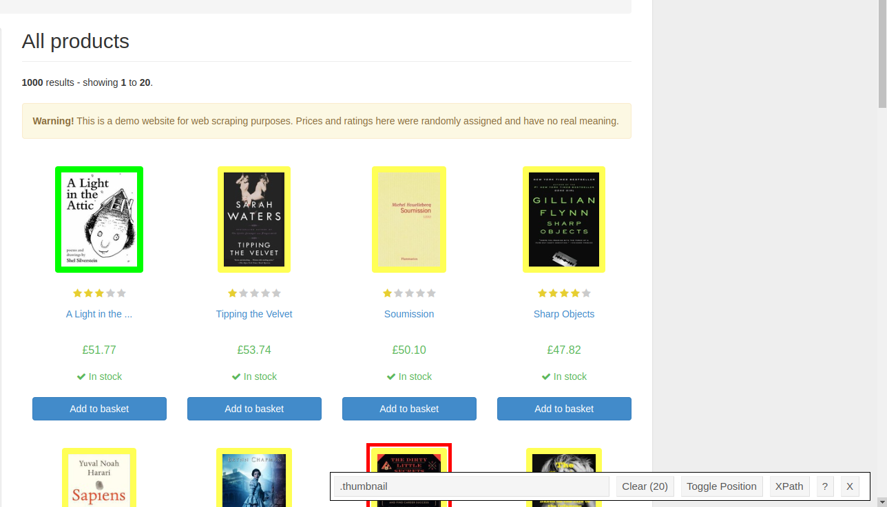
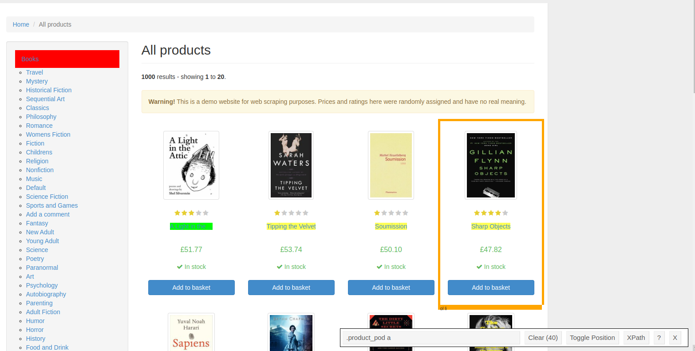
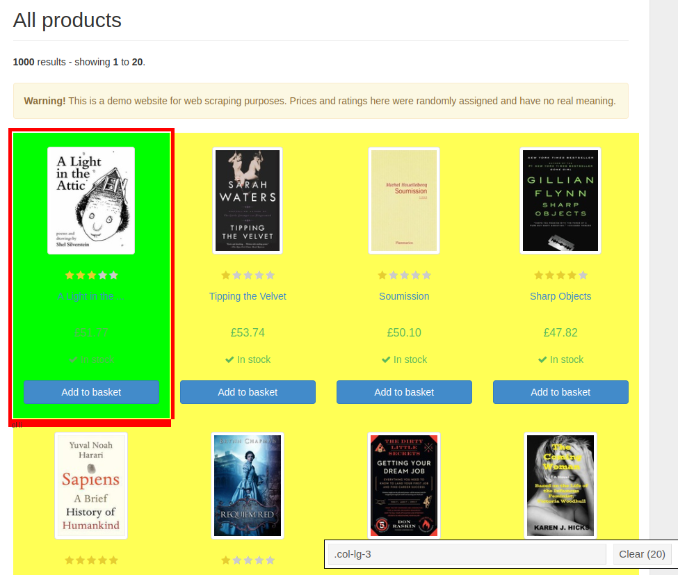

# Easy selector recipe
## Prepare
To quickly write a selector you will need:

- Chromium-based browser (Chromium, Chrome, Brave, Vivaldi, etc...)
- [Selector Gadget](https://chrome.google.com/webstore/detail/selectorgadget/mhjhnkcfbdhnjickkkdbjoemdmbfginb) extension

## Usage
This example will use [books.toscrape](https://books.toscrape.com/)

!!! warning
     If you are using selenium/playwright to collect data then you can ignore this warning.

     The example considers a simple case where the page in the browser is similar
     to the original raw HTML document.

     Http request libraries return raw document (in the browser mode `view-source:`
     or CTRL+U hotkey). To do this, check first selectors in testers,
     for example [try.jsoup.org](https://try.jsoup.org/) (css + xpath) or
     [xpather.com](http://xpather.com/) (xpath)


Interactively select elements that need to be parsed and copy selectors output:

Product image:



`.thumbnail`

Product title:



`.product_pod a`

Transfer to parser:

!!! note
    - `::attr(title)` query same as `.attrib.get('title')`
    - `::attr(src)` query same as `.attrib.get('src')`

```python
import pprint
import requests


from scrape_schema import BaseSchema, Parsel


class EasyParser(BaseSchema):
    title: list[str] = Parsel().css('.product_pod a ::attr(title)').getall()
    src: list[str] = Parsel().css('.thumbnail ::attr(src)').getall()

if __name__ == '__main__':
    resp = requests.get('https://books.toscrape.com/')
    pprint.pprint(EasyParser(resp.text).dict(), compact=True)
# {'src': ['media/cache/2c/da/2cdad67c44b002e7ead0cc35693c0e8b.jpg',
#         'media/cache/26/0c/260c6ae16bce31c8f8c95daddd9f4a1c.jpg',
# ...
#         'media/cache/27/a5/27a53d0bb95bdd88288eaf66c9230d7e.jpg'],
# 'title': ['A Light in the Attic', 'Tipping the Velvet', 'Soumission',
#           'Sharp Objects', 'Sapiens: A Brief History of Humankind',
# ...
#           'Libertarianism for Beginners', "It's Only the Himalayas"]}
```

Now let's improve the parser. First we will get the product cards and only then the data:


`.col-lg-3`

and rewrite code:

```python
import pprint

import requests

from scrape_schema import BaseSchema, Parsel, Nested

class Item(BaseSchema):
    title: str = Parsel().css('.product_pod a ::attr(title)').get()
    src: str = Parsel().css('.thumbnail ::attr(src)').get()


class EasyParser(BaseSchema):
    items: list[Item] = Nested(Parsel().css('.col-lg-3'))


if __name__ == '__main__':
    resp = requests.get('https://books.toscrape.com/')
    pprint.pprint(EasyParser(resp.text).dict(), compact=True)
# {'items': [{'src': 'media/cache/2c/da/2cdad67c44b002e7ead0cc35693c0e8b.jpg',
#            'title': 'A Light in the Attic'},
#           {'src': 'media/cache/26/0c/260c6ae16bce31c8f8c95daddd9f4a1c.jpg',
#            'title': 'Tipping the Velvet'},
# ...
#           {'src': 'media/cache/27/a5/27a53d0bb95bdd88288eaf66c9230d7e.jpg',
#            'title': "It's Only the Himalayas"}]}
```
